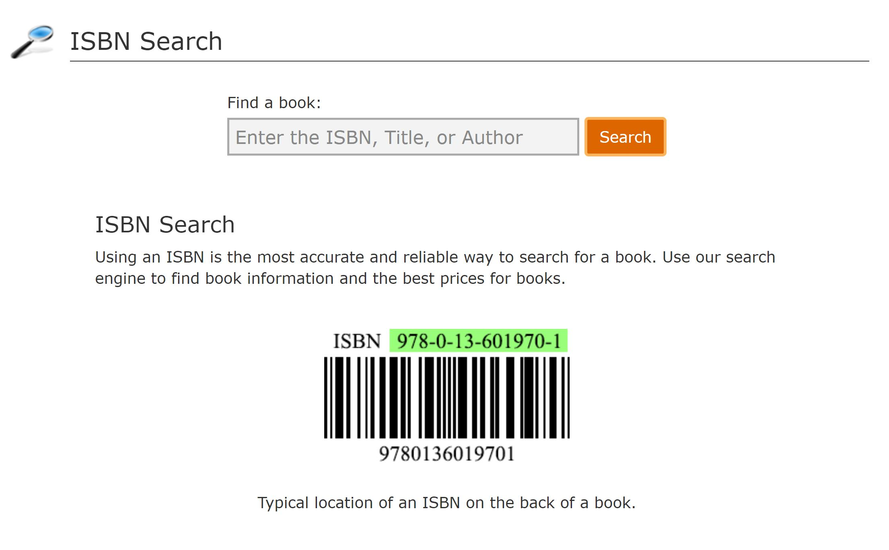

# **Website for**

# **BOOK FINDER**

**Milestone Project 2 Interactive Front-End Development**

By Kevin Ho | traderkev54@yahoo.com

**Context**

This project involves writing custom HTML5, CSS3 &amp; JavaScript code with the google search API create an interactive frontend website for a document and book finding tool called BOOK FINDER.

- Encourage interactivity by offering free document and book search tools that visitors can use.
- These tools are used for searching for manuals and openly-available books and presentations.
- Caution will be given to visitors to respect copyright issues and respect privacy
- 2 tools are offered here:

  - **Document Search** - is a google search tool using the SERPSTACK API and configured to search for PDF, Powerpoint, Excel, or WORD files. Results are shown sequentially and users can click individual results to download these files.

  - **Book Search** – is actually 2 search tools using the 1) ISBNsearch.org search bar to locate ISBN numbers of book titles, and the 2) google book search database. Results are clickable and entire books may be read.

External user&#39;s goal: To have free search tools to find openly-sourced documents and free books.

Site owner&#39;s goal: To showcase search tools, and to encourage people to use the tools to find free open-copyright books online.

**Demo Version of the Website**

**The website can be found in the github repository:** [**https://baguamaster.github.io/kevfinal2/**](https://baguamaster.github.io/kevfinal2/)

# **Website Purpose**

The purpose of this website is to bring free open-sourced books and documents to students and researchers.

**Two main classes of tools are offered free:**

1. DOCUMENT SEARCH - is a google search tool using the SERPSTACK API and configured to search for PDF, Powerpoint, Excel, or WORD files. Results are shown sequentially and users can click individual results to download these files.

1. BOOK SEARCH – is actually 2 search tools using the 1) ISBNsearch.org search bar to locate ISBN numbers of book titles, and the 2) google book search database. Results are clickable and entire books may be read.

These search tools are powered by an underlying google search API from SERPSTACK

Because copyright despite the fact that most of these books are in the public domain, search results are intentionally kept to one page only. And all visitors have to accept the User Acceptance Policy in every page, in order to recognize their liability in cases of abuse.

# **Strategic Considerations**

**Identifying External Users**

The website is designed to attract visitors to play with the search tools via:

1. Finding hard-to-find manuals in electronic form
2. Locating university teaching decks on any topic
3. Finding ebooks in PDF format
4. Finding WORD documents relevant to the search term
5. Locating POWERPOINT presentations specific to a search term
6. Searching for EXCEL files concerning material on the search term

External users/Target audience are largely students or book lovers seeking to find documents online.

**Identifying External Users&#39; Goals**

Those seeking to use a specialized search engine to find free e-books and documents. To have the search tool present useful and relevant search results given self-imposed the 1-page limit.

**Identifying Site Owner&#39;s Goals**

The site owner, BOOK FINDER, wants to use the website to:

1. Allow students to access free-books and documents on the web
2. Search for ISBN book identification numbers given titles of authors
3. Use the ISBN for searching for whole e-books

An ISBN is an International Standard Book Number. ISBNs were 10 digits in length up to the end of December 2006, but since 1 January 2007 they now always consist of 13 digits. ISBNs are calculated using a specific mathematical formula and include a check digit to validate the number.

# **Scope**

**Functional Requirements**

**Mandatory**

**LO1 Design, develop and implement a dynamic front-end web application using HTML, CSS and JavaScript**

**LO2 Implement front-end interactivity, using core JavaScript, JavaScript libraries and/or Application Programming Interfaces (APIs)**

**LO3 Test an interactive front-end web application through the development, implementation and deployment stages**

**LO4 Deploy an interactive front-end web application to a Cloud platform**

**LO5 Demonstrate and document the development process through a version control system such as GitHub**

**Optional**

- Design a web application following the principles of UX design which meets accessibility guidelines, is easy to navigate and allows the user to find information and resources intuitively

- Design a web application that lets the user initiate and control actions, and gives feedback

- Implement a web application whose purpose is immediately evident to a new user and which provides a good solution to the user&#39;s demands and expectations.

- Write code such that users who direct to a non-existent page or resource are redirected back to the main page without having to use browser navigation buttons

- Commit often, for each individual feature/fix, ensuring that commits are small, well-defined and have clear, descriptive messages

- Present a clear rationale for the development of the project, in the README, demonstrating that it has a clear, well-defined purpose addressing the needs of, and user stories for a particular target audience (or multiple related audiences).

- Document the UX design work undertaken for this project, including any wireframes, mockups, diagrams, etc created as part of the design process, and the reasoning behind it. Include diagrams created as part of the design process and demonstrate that these have been followed through to implementation

- Document testing fully to include evaluation of bugs found and their fixes and explanation of any bugs that are left unfixed.

- Fully document the deployment procedure in a section in the README file.

**Content Requirements**

**Mandatory**

**LO1 Design, develop and implement a dynamic front-end web application using HTML, CSS and Javascript**

- Design a web application that meets accessibility guidelines, follows the principles of UX design and presents a structured layout and navigation model, and meets its given purpose

- Design interactivity for a web application that lets the user initiate and control actions, and gives feedback

- Write custom JavaScript, HTML and CSS code to create a responsive front-end web application consisting of one or more HTML pages with significant interactive functionality

- Write JavaScript code to produce relevant responses to user actions

- Implement an interactive web application that incorporates images or graphics of usable resolution, legible, unobscured text, consistent styling, undistracted foregrounds

# **Site Structure Development &amp; Information Organisation (corresponding to above L01)**

**Information Architecture**

**Content Inventory**

Information required on the website to fulfil the content requirements.

1. Explanation of what BOOK FINDER is
2. Allow users to interact with DOCUMENT SEARCH page
3. Allow users to interact with BOOK SEARCH page
4. Easy to use search bars
5. Ample warning against abuse of the tools and responsibility of the visitor to exercise legal behaviour

**Content Structure (Sitemap)**

The website will be arranged in a simple order:

Home Page| Document Search | Book Search

**The UI/UX has been deliberately kept simple to encourage immediate interactivity with the search functions in each if the pages.**

1. **HOME PAGE:**
  - It opens with a simple introduction and instruction to use the search tools.
  - Comes with a warning to respect copyright
  - Upper nav bar has links to Book Search and Document Search

1. **BOOK SEARCH:**
  - Shows an ISBN search bar on the left of the page meant for finding ISBN numbers of titles.
  - Results are displayed as per ISBNsearch.org&#39;s template, showing book ISBN.
  - Once ISBN numbers uniquely identifying books are found, the user may use the google book search bar on the right to locate whole e-books to read.
  - Results are shown in the right column where the user can click and open an e-book to read on the web browser.
  - **NOTE: Not every book can be found in the google book database (there is a warning to this effect in read)**

1. **DOCUMENT SEARCH:**
  - Shows a simple search bar with instructions on what to type
  - The user has a choice of what type of documents searched for (pdf files, powerpoint presentations, excel data files, word documents)
  - Results are shown as a single column with downloadable links for the files.

1. **CAUTION:**

**Note: if there are no search results, it either means the API has overrun its daily 100-query limit, or the search has been stopped by Google AIs – this is particularly true given the high-risk search script in this search tool.**

**Google may sometimes require users to do a CAPTCHA if it senses too many search requests of this nature from a single IP.**

**If this happens, the user should open a VPN (virtual private network) and try again.**

**Website Interactivity**

1. Usability
  1. Website navigation controls are kept simple to be familiar to a web surfer, and a same consistency in design elements permeates throughout the website.
    1. Logo that leads back to the home page
    2. Main navigation bar at the top
    3. Pagination is included to help visitors identify which part of the site they are at
    4. Easy to identify buttons
2. Reader Comprehension
  1. Content are grouped according to subject matter and prose is broken up when long.

  1. The Flesch Readability Test = 54.7, Flesch-Kincaid Grade Level Score = 7, which means the website is easily understood by 13-14 year olds and up.

1. Operability
  1. The visitor should be able to easily navigate without trouble.
  2. There is a form function in the &quot;subscribe&quot; page to allow communication
  3. There is sufficient information for an interested party to communicate.
  4. Both search engines follow the familiar search bar and radio buttons format
2. Attractiveness
  1. A responsive design takes into consideration how it looks when on viewed on a desktop browsers as well as smaller screens like mobile phone. The layout will change to cater for different size of the device
  2. Utilisation of white spaces between different sections and components of the page to increase readability
3. Usability compliance
  1. Semantic HTML to enhance code readability
  2. Optimisation of website elements
  3. Compliance to website accessibility guidelines
  4. SEO optimization will be for subsequent steps

# **Page Structure and Interactions**

**Site Map**

**Navigation Elements**

Responsiveness and utility courtesy of Bootstrap…

**Logo**

The logo found on either the navbar links or the footer to Home page [Bootstrap Component - Navbar]

**Main Navigation**

Main Navigation is a fixed position menu at the top of every web page. The navbar links are listed clearly and they are hyperlinked to their respective pages. [Bootstrap Component - Navbar]

**Collapsible Hamburger Mobile Menu**

The top navigation will be minimised into a hamburger menu when displayed in mobile screens or other small screens. Clicking on it will display the familiar 4 choices. [Bootstrap Component - Navbar]

**Footer**

The footer contains the logo, and disclaimers

# **UX**

**Colour**

An orange, red, black white theme is used in this instance.

Have tried blue but early UX testers thought blue to be too corporate and preferred the connotation of red and orange as an energetic colour. The corporate logo has red words

**Fonts**

Monserrat font is used throughout for the website as it is clean, not too common and has nice kerning spaces.

**Images**

Images are chosen for their powerful storytelling ability and whilst some real pictures are used, some stock images were utilized in this demo version. No doubt in the production version, some professional images will need to be shot again.

**Copy**

Copy is written in an easy-going style, and aims to educate the reader on the many aspects of information security.

**Responsiveness**

The site is meant to be responsive to many devices, from desktop and laptop screen to tablets and smart mobile phones. It can be viewed in both portrait and landscape orientation. The breakpoints are usually half of the visual range in this instance.

**Consistency of design and messaging**

All elements on the website are intentioned to carry the same look and feel. The colour scheme and design schema using curved boxes/buttons carry this through. The call to action is ever-present in every page.

**Contact Form**

The contact form in the Contact Us page is meant to facilitate either email, voice, or drop-in communications. It is deliberately kept simple.

**LO2 Implement front-end interactivity, including user forms, using core JavaScript, JavaScript libraries and/or Application Programming Interfaces (APIs)**

- Write JavaScript code, that passes through a linter (e.g. Jshint) with no major issues, and write validated HTML and CSS code.
- Write JavaScript functions that correctly implement compound statements such as if conditions and/or loops
- Write code that intelligently handles empty or invalid input data
- Implement appropriate working functionality for all project requirements.
- Organise non-trivial JavaScript code in external file(s) linked to at the bottom of the body element (or bottom of head element if needs to be loaded before the body HTML) and CSS code in external files linked to HTML in the head element
- Write code that meets minimum standards for readability (comments, indentation, consistent and meaningful naming conventions).
- Name files consistently and descriptively, without spaces or capitalisation to allow for cross-platform compatibility.
- Write code that does not generate internal errors on the page or in the console as a result of user actions
- Organise code and assets files in directories by file type.

**Jshint Linter**

- JS scripts have cleared Jshint Linter
- What remains are largely esversion:6 syntax issues.

**Javascript functions in the website**

**JS functions used are found in the following areas:**

Book Search

Document Search

**Organisation of JS Script**

- All non-trivial JS scripts, where appropriate, are kept as separate files and maintained accordingly
- File types are named accordingly to the original schema and maintained consistently
- This aids in enhancements or refinements easily
- The JS login function, due to its brevity, is kept in the index.html file

- All functions have been rested rigorously and in some cases, limited by the daily 100 search limited imposed by the Google search API provider, SERPSTACK.
- Additional search tags are appended to the original user-defined input to aid in specific searches for documents etc

# **API**

- The search tools are powered by Google Search APIs, and provided free for up to 100 searches a day by SERPSTACK
- Additional search tags needed to be added to specific searches (determined by user and his/her choice of search types)

**LO3 Test an interactive front-end web application through the development, implementation and deployment stages**

- Design and implement manual testing procedures to assess functionality, usability and responsiveness of the web application
- Insert screenshots of the finished project that align to relevant user stories
- Apply test procedures during development, and implementation stages and test to ensure the deployed version matches the development version
- Fully document the results of well-planned manual testing procedures to assess the website&#39;s functionality, usability and responsiveness.

# **Testing Phase**

All aspects of the website are tested with each series of github commits.

Testing procedure usually follows this format:

- Code is written and eyeballed on the Chrome browser for subtleties in changes
- Amendments are made and visually crosschecked
- Errors are caught early when functions or UX elements are seen to be out of place or do not work
- In cases where functions do not work as intended (or do not work at all), internet resources are consulted to check consistency of approach with current practices
- In some cases where bugs are not found easily, the individual component is cloned to another visual studio code window (UAT environment) and operated upon till a solution is found
- This method prevents accidental and unintended changes to the parent file
- Improvements that are successful are then copied back to the original parent file
- Thus the steps are:
  - WRITE CODE \&gt; ERROR DETECTED \&gt; BUG FIX PROCESS \&gt; ISOLATE CODE IF NEEDED \&gt; RESOLVE ON SEPARATE INSTANCE OF CODE \&gt; SOLUTION FOUND \&gt; RE-INTEGRATE BACK TO ORIGINAL PARENT FILE

Post deployment test procedures:

- Comparisons made between development and production versions are monitored
- Differences are reconciled by a detailed line-by-line debugging
- Better methods are deployed if the code is proven to be more efficient

**Validating Markup**

- 3 pages checked using W3C Jigsaw CSS Validator (https://jigsaw.w3.org/css-validator/)
  - NO errors
-  
- 3 pages validated using W3 Markup Validation Service ([http://validator.w3.org/](http://validator.w3.org/))
  - home.html - Document checking completed. No errors or warnings to show.
  - contact.html - Document checking completed. No errors or warnings to show.
  - about.html - Document checking completed. No errors or warnings to show.

- 3 pages checked using W3C Link Checker ([https://validator.w3.org/checklink](https://validator.w3.org/checklink))
  - home.html – none
  - book.html – none
  - document.html – none

**Navigation Check**

- Was done on each link to determine issues. Any found were rectified.
- 10 persons were invited to check the website for consistencies

**LO4 Deploy an interactive front-end web application to a Cloud platform**

- Deploy a final version of the interactive web application code to a cloud-based hosting platform (e.g. GitHub Pages)
- Ensure that the deployed application is free of commented out code and has no broken internal links
- Use Git &amp; GitHub for version control of an interactive web application up to deployment

**LO5 Demonstrate and document the development process through version control system such as GitHub**

- Document the full development cycle, with clear evidence given through commit messages, the README.
- Write a README.md file in English for the interactive web application that explains its purpose and the value that it provides to its users.
- Clearly separate and identify code written for the interactive web application and code from external sources (e.g. libraries or tutorials). Attribute any code from external sources to its source via comments above the code and (for larger dependencies) in the README.
- Use consistent and effective markdown formatting, that is well-structured, easy to follow, and has few grammatical errors, when writing a README file.

**Deployment**

- The code is updated as a github repository and committed to on a regular basis

# **Technologies Applied**

- **HTM5**  to structure the webpages and  **CSS3**  to style them.
- **JavaScript to run functions**
- **SERPSTACK Google Search API used as engine for the 2 search tools**
- **Git**  \* for Versioning Control System and  **GitHub**  for repositories.
- **Bo**** otstrap 4.5 ****, including its components and utilities for layout. Key elements favoured:**
  - NavBar is used for the main navigation,
  - Distinct images are used as attention grabber
  - Jumbotron is used for carrying the call to action button
  - CSS Stylesheet from w3newbie (https://w3newbie.com/responsive-html5-web-design-tutorial-and-free-template-code/)
  - Code Institute&#39;s templates ([https://github.com/Code-Institute-Org/gitpod-full-template](https://github.com/Code-Institute-Org/gitpod-full-template)) to start the coding.
  - The template used for Readme.md is also from Code Institute ([https://github.com/Code-Institute-Solutions/readme-template/blob/master/README.md](https://github.com/Code-Institute-Solutions/readme-template/blob/master/README.md))

- **Other Tools are also used in the course of development:**
  - For validating JavaScript:
    - JShint validator ([https://jshint.com/](https://jshint.com/))
  - For validating markup:
    - W3 Markup Validator ([http://validator.w3.org/](http://validator.w3.org/))
  - For validating CSS:
    - W3 Jigsaw Validator (https://jigsaw.w3.org/css-validator/)
  - For checking links:
    - W3C Link Checker ([https://validator.w3.org/checklink](https://validator.w3.org/checklink))
  - For image editing
    - Adobe Lightroom ([https://lightroom.adobe.com/](https://lightroom.adobe.com/))
  - For responsiveness:
    - Responsive Web Design Checker ([https://responsivedesignchecker.com/](https://responsivedesignchecker.com/))
  - For mindmapping:
    - Mindup mind mapper ([https://www.mindmup.com/](https://www.mindmup.com/))
  - For UX readability:
    - Flesch-Kincaid readability test ([https://www.webfx.com/tools/read-able/](https://www.webfx.com/tools/read-able/))
  - For UX viewing on various device formats:
    - Responsinator: ([https://www.responsinator.com/](https://www.responsinator.com/))

# **Deployment**

**Preparation**

All major changes were committed on a regular basis to github.

**Content**

- Ensured all the last changes were saved and committed.
- Committed a final Git Push
- Latest deployment enabled

**Git Pages**

- [https://github.com/baguamaster/kevfinal2](https://github.com/baguamaster/kevfinal2)

**Demo Website**

- [https://baguamaster.github.io/kevfinal2/](https://baguamaster.github.io/kevfinal2/)
