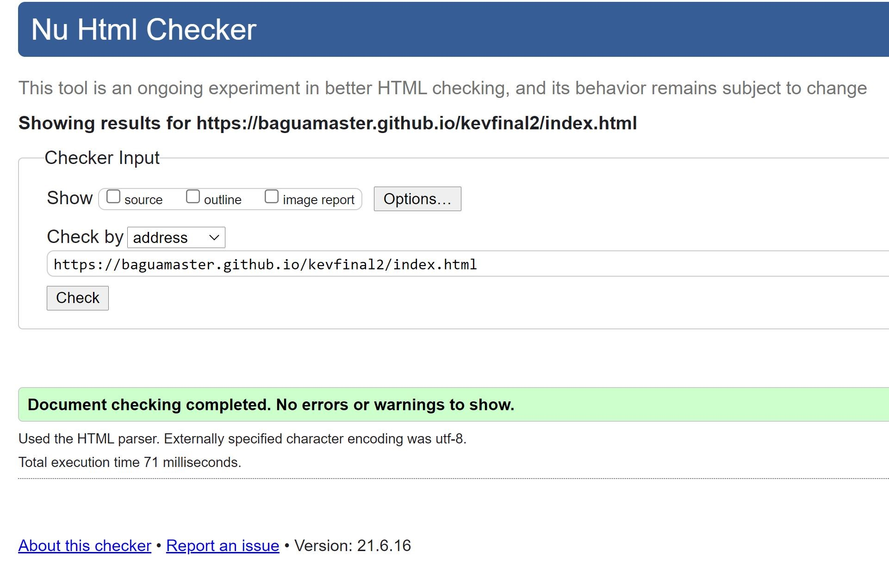

# **Website for**

# **Fortress Asia OSINT Tools**

**Milestone Project 2 Interactive Front-End Development**

By Kevin Ho | traderkev54@yahoo.

**Context**

This project involves writing custom HTML5, CSS3 &amp; JavaScript code with the google search API create an interactive frontend website for a Cybersecurity Consulting company called FORTRESS ASIA

- Encourage interactivity by offering free open-sourced intelligence (OSINT) search tools that visitors can use.
- These tools are used by cybersecurity penetration testers to reconnoiter clients front end websites and networks, but can be used for harmless applications like searching for manuals and openly-available books and presentations.
- Caution will be given to visitors to respect copyright issues and respect privacy
- To showcase the &quot;tip-of-the-iceberg&quot; skillsets of FORTRESS ASIA, such that visitors may register for the paid services that gains them access to much more powerful search engines.

External user&#39;s goal: To have free search tools to find openly-sourced documents; to also understand the importance of cybersecurity.

Site owner&#39;s goal: To showcase cybersecurity search tools, and to encourage signups for its more advanced services or consulting sessions.

**Demo Version of the Website**

The website can be found in the github repository: [https://baguamaster.github.io/kevfinal2/](https://baguamaster.github.io/kevfinal2/)

# **Website Purpose**

The purpose of this website is to bring awareness about the skillsets and tools FORTRESS ASIA as a cybersecurity consulting firm offers to its paying customers.

**Two main classes of tools are offered free:**

1. FORTRESS ASIA document search tool, called **&quot;LIBERATUS&quot;** – a play on two latin words &quot;book&quot; and &quot;freedom&quot; – denoting there is joy in finding free copyright-free or open-sourced books, manuals, presentations or documents.

1. FORTRESS ASIA cybersecurity vulnerability search tool, called **&quot;CERBERUS&quot;** – the mythical relentless 3-headed dog from Hades – which is dogged (pardon the pun) in finding vulnerabilities in webcams, routers, servers and password databases.

These search tools are powered by an underlying google search API from SERPSTACK. What makes these tools dangerous is that it combines innocent google search strings with specialized script to specifically find documents, unsecured webcams, vulnerable servers and the like.

As a result of the potential for abuse, search results are intentionally kept to one page only. And all visitors have to accept the User Acceptance Policy in every page, in order to recognize their liability in cases of abuse.

So once persuaded by the &quot;tip-of-the-iceberg&quot; power of these 2 search tools, it is hoped that that visitor will become a registered, paying customer of FORTRESS ASIA, either for its more powerful backend tools (implied in this website but not shown), or to be a paying customer seeking cybersecurity solutions.

# **Strategic Considerations**

**Identifying External Users**

The website is designed to attract visitors to play with the search tools via:

1. Finding hard-to-find manuals in electronic form
2. Locating university teaching decks on any topic
3. Finding ebooks in PDF format
4. To be surprised by the plethora of unsecured webcams online
5. To learn how exposed routers and servers can easily be the first step of an attack
6. Being shocked at how IDs and passwords can be leaked online - and where to find them

External users/Target audience are largely people initially seeking to find documents online, or business owners curious about cybersecurity risks.

**Identifying External Users&#39; Goals**

Those seeking to use a specialized search engine to find free books and documents. To have the search tool present useful and relevant search results given self-imposed the 1-page limit. (For those who want more will have to sign up)

Those seeking to understand how exposed outward-facing internet-of-things (IoT) platforms are. Unsecured webcams, routers, servers lead easily to a would-be hacker extracting useful information such as time and place information, IDs, passwords, server details etc. Visitors to this site will be able to experience all of the above with the right search terms. (instructions on use will be on each of the 2 search tool pages.

**Identifying Site Owner&#39;s Goals**

The site owner, FORTRESS ASIA, wants to use the website to:

1. Promote awareness its powerful backend cybersecurity backend tools (implied but not shown)
2. Raise the profile FORTRES ASIA and its capabilities
3. Encourage visitors to go for a free trial
4. Make them understand that the cybersecurity tools can be used for bad and for good

# **Scope**

**Functional Requirements**

**Mandatory**

**LO1 Design, develop and implement a dynamic front-end web application using HTML, CSS and JavaScript**

**LO2 Implement front-end interactivity, using core JavaScript, JavaScript libraries and/or Application Programming Interfaces (APIs)**

**LO3 Test an interactive front-end web application through the development, implementation and deployment stages**

**LO4 Deploy an interactive front-end web application to a Cloud platform**

**LO5 Demonstrate and document the development process through a version control system such as GitHub**

**Optional**

- Design a web application following the principles of UX design which meets accessibility guidelines, is easy to navigate and allows the user to find information and resources intuitively

- Design a web application that lets the user initiate and control actions, and gives feedback

- Implement a web application whose purpose is immediately evident to a new user and which provides a good solution to the user&#39;s demands and expectations.

- Write code such that users who direct to a non-existent page or resource are redirected back to the main page without having to use browser navigation buttons

- Commit often, for each individual feature/fix, ensuring that commits are small, well-defined and have clear, descriptive messages

- Present a clear rationale for the development of the project, in the README, demonstrating that it has a clear, well-defined purpose addressing the needs of, and user stories for a particular target audience (or multiple related audiences).

- Document the UX design work undertaken for this project, including any wireframes, mockups, diagrams, etc created as part of the design process, and the reasoning behind it. Include diagrams created as part of the design process and demonstrate that these have been followed through to implementation

- Document testing fully to include evaluation of bugs found and their fixes and explanation of any bugs that are left unfixed.

- Fully document the deployment procedure in a section in the README file.

**Content Requirements**

**Mandatory**

**LO1 Design, develop and implement a dynamic front-end web application using HTML, CSS and Javascript**

- Design a web application that meets accessibility guidelines, follows the principles of UX design and presents a structured layout and navigation model, and meets its given purpose

- Design interactivity for a web application that lets the user initiate and control actions, and gives feedback

- Write custom JavaScript, HTML and CSS code to create a responsive front-end web application consisting of one or more HTML pages with significant interactive functionality

- Write JavaScript code to produce relevant responses to user actions

- Implement an interactive web application that incorporates images or graphics of usable resolution, legible, unobscured text, consistent styling, undistracted foregrounds

# **Site Structure Development &amp; Information Organisation (corresponding to above L01)**

**Information Architecture**

**Content Inventory**

Information required on the website to fulfil the content requirements.

1. Explanation of what FORTRESS ASIA is
2. Services that FORTRESS ASIA specializes in
3. The &quot;LIBERATUS&quot; search tool for finding open-sourced documents, manuals, presentations &amp; files
4. The &quot;CERBERUS&quot; search tool for finding vulnerable webcams, servers, routers and password information
5. Imagery appropriate to these tools
6. Ample warning against abuse of the tools and responsibility of the visitor to exercise legal behaviour
7. Contact details / sign up page
8. To at all times expound the FORTRESS ASIA Value proposition

**Key Classes of Images required**

1. Cybersecurity-centric images
2. Book/academic-centric images
3. Vulnerability assessment-centric images
4. FORTRESS ASIA-related corporate photos &amp; logos
5. Services-related images

**Content Structure (Sitemap)**

The website will be arranged in a simple order:

Login Page\&gt; Home Page \&gt; About \&gt; LIBERATUS \&gt; CERBERUS \&gt; Sign Up for more Powerful Tools

**Each page has its own hyperlinks relevant to it**

1. **Login Page:**
  - **Currently on demo mode only (user id: demo; password: pw)**
  - **Note: this website is a non-production demo-only version 0.9**

1. **Home Page:**
  - It opens with a &quot;bang&quot;, putting one single &quot;live&quot; visual embed from the FORTINET cybersecurity website – their global live cyber threat map
    1. This gives the viewer a real-time view on global cyber attack vectors as they are detected by the FORTINET network
    2. The box at the bottom of the embed shows specific data of attack vectors, countries involved and the type of attack payload.
  - The nav bar at the top allows easy access to the other sections of the website.
  - Further down the carousel is a 2 column section which draws attention to 3 things with a button:
    1. &quot; **LIBERATUS&quot;** – This is the first of 2 search engines, allowing the visitor to download openly available files, ebooks, presentations, manuals, spreadsheets &amp; other documents.
      1. **This is intended for academic and research purposes,** and at the same time highlights the unsecure nature of files in the internet.
      2. **Ample warning is provided so that the user is aware of infringement risks to Copyright and to use the search tool in a responsible manner.**
    2. &quot; **CERBERUS&quot;** – This is the 2nd search tool that has been configured to locate open webcams, vulnerable servers and exposed email lists.
      1. **Again, this is for academic and research purposes** , and to demonstrate the widespread insecurity of net-facing machines and interfaces.
      2. **Warnings are escalated to make it clear that any abuse of the information gathered through this search tool may be subject ot criminal proceedings**.
      3. **Search results are limited to a single page**. For the more serious user, a registration is necessary, and memberships are curated.
  - Every single page in the website has a jumbotron with a link to the &quot;Contact Us&quot; button. – This is the call to action.
  - Beneath the call to action is the footer with permanent warning and disclaimer

1. **About:**

  - Shows the 6 main areas of subject matter expertise FORTRESS ASIA has in the cybersecurity &amp; information security space.
  - Beneath that is a showcase of FORTRESS ASIA&#39;s closest 3 collaborators in the security, cyberdefence &amp; digital enablement space in the region.
  - The bottom part has the call to action jumbotron

1. **LIBERATUS:**
  - &quot;LIBERATUS&quot; – This is the first of 2 search engines, allowing the visitor to download openly available files, ebooks, presentations, manuals, spreadsheets &amp; other documents.
  - This is intended for academic and research purposes, and at the same time highlights the unsecure nature of files in the internet.
  - Ample warning is provided so that the user is aware of infringement risks to Copyright and to use the search tool in a responsible manner.
  - **The underlying technology driving this search tool is the Google Search API, provided by SERPSTACK.**
  - **Additional scripting has been added to allow specific searches related to LIBERATUS**
  - **Searches are done by entering key words and selecting specific radio-button file types**
  - **Note: if there are no search results, it either means the API has overrun its daily 100-query limit, or the search has been stopped by Google AIs**

1. **CERBERUS:**
  - &quot;CERBERUS&quot; – This is the 2nd search tool that has been configured to locate open webcams, vulnerable servers and exposed email lists.
  - The name Cerberus is derived from the mythical 3-headed dog from Hades, and is known for relentless pursuit of prey and has 360 degree awareness.
  - Again, this is for academic and research purposes, and to demonstrate the widespread insecurity of net-facing machines and interfaces.
  - Warnings are escalated to make it clear that any abuse of the information gathered through this search tool may be subject to criminal proceedings.
  - Search results are limited to a single page. For the more serious user, a registration is necessary, and memberships are curated.
  - **The underlying technology driving this search tool is the Google Search API, provided by SERPSTACK.**
  - **Additional scripting has been added to allow specific searches related to CERBERUS, all of which CAN BE abused within the cybersecurity context.**
  - **Searches are done by entering key words and selecting specific radio-button file types**
  - **Note: if there are no search results, it either means the API has overrun its daily 100-query limit, or the search has been stopped by Google AIs – this is particularly true given the high-risk search script in this search tool.**
  - **Google may sometimes require users to do a CAPTCHA if it senses too many search requests of this nature from a single IP**
  -

1. **Subscribe to powerful tools:**

  - Is the de facto &quot;contact&quot; page
  - Interested parties may register to join as a subscriber
  - Subscribers will have access to more vulnerability assessment tools, used in ethical cybersecurity penetration testing and research
  - Reveals basic contact details of the company
  - The form section is intended to facilitate quick logging of interest, which will be followed up with an interview process.

**Website Interactivity**

1. Usability
  1. Website navigation controls are kept simple to be familiar to a web surfer, and a same consistency in design elements permeates throughout the website.
    1. Logo that leads back to the home page
    2. Main navigation bar at the top
    3. Pagination is included to help visitors identify which part of the site they are at
    4. Easy to identify buttons
2. Reader Comprehension
  1. Content are grouped according to subject matter and prose is broken up when long.
  2. The Flesch Readability Test = 54.7, Flesch-Kincaid Grade Level Score = 7, which means the website is easily understood by 13-14 year olds and up.
  

1. Operability
  1. The visitor should be able to easily navigate without trouble.
  2. There is a form function in the &quot;subscribe&quot; page to allow communication
  3. There is sufficient information for an interested party to communicate.
  4. Both search engines follow the familiar search bar and radio buttons format
2. Attractiveness
  1. A responsive design takes into consideration how it looks when on viewed on a desktop browsers as well as smaller screens like mobile phone. The layout will change to cater for different size of the device
  2. Utilisation of white spaces between different sections and components of the page to increase readability
3. Usability compliance
  1. Semantic HTML to enhance code readability
  2. Optimisation of website elements
  3. Compliance to website accessibility guidelines
  4. SEO optimization will be for subsequent steps

# **Page Structure and Interactions**

**Interface Design**

- Each page will include 4 parts - header, main, jumbotron call to action and footer.
- Header, Call to action and footer include sections that will be repeated all the pages to improve predictability and consistency.
- Header will include a logo and the main navbars
- The jumbotron containing the call to action button will link to the &quot;Contact Us&quot; page
- Footer will include a links to social media
- The main content section will display content related to the relevant subject matter

**Site Map**

**Navigation Elements**

Responsiveness and utility courtesy of Bootstrap…

**Logo**

The logo found on either the navbar links or the footer to Home page [Bootstrap Component - Navbar]

**Main Navigation**

Main Navigation is a fixed position menu at the top of every web page. The navbar links are listed clearly and they are hyperlinked to their respective pages. [Bootstrap Component - Navbar]

**Collapsible Hamburger Mobile Menu**

The top navigation will be minimised into a hamburger menu when displayed in mobile screens or other small screens. Clicking on it will display the familiar 4 choices. [Bootstrap Component - Navbar]

**Call-to-action Jumbotron**

This section features on every page and has a button offering a free trial, which is hyperlinked to the Contact Us page.

**Footer**

The footer contains the logo, and disclaimers

# **UX**

**Colour**

An orange, red, black white theme is used in this instance.

Have tried blue but early UX testers thought blue to be too corporate and preferred the connotation of red and orange as an energetic colour. The corporate logo has red words

**Fonts**

Monserrat font is used throughout for the website as it is clean, not too common and has nice kerning spaces.

**Images**

Images are chosen for their powerful storytelling ability and whilst some real pictures are used, some stock images were utilized in this demo version. No doubt in the production version, some professional images will need to be shot again.

**Copy**

Copy is written in an easy-going style, and aims to educate the reader on the many aspects of information security.

**Responsiveness**

The site is meant to be responsive to many devices, from desktop and laptop screen to tablets and smart mobile phones. It can be viewed in both portrait and landscape orientation. The breakpoints are usually half of the visual range in this instance.

**Consistency of design and messaging**

All elements on the website are intentioned to carry the same look and feel. The colour scheme and design schema using curved boxes/buttons carry this through. The call to action is ever-present in every page.

**Contact Form**

The contact form in the Contact Us page is meant to facilitate either email, voice, or drop-in communications. It is deliberately kept simple.

**LO2 Implement front-end interactivity, including user forms, using core JavaScript, JavaScript libraries and/or Application Programming Interfaces (APIs)**

- Write JavaScript code, that passes through a linter (e.g. Jshint) with no major issues, and write validated HTML and CSS code.
- Write JavaScript functions that correctly implement compound statements such as if conditions and/or loops
- Write code that intelligently handles empty or invalid input data
- Implement appropriate working functionality for all project requirements.
- Organise non-trivial JavaScript code in external file(s) linked to at the bottom of the body element (or bottom of head element if needs to be loaded before the body HTML) and CSS code in external files linked to HTML in the head element
- Write code that meets minimum standards for readability (comments, indentation, consistent and meaningful naming conventions).
- Name files consistently and descriptively, without spaces or capitalisation to allow for cross-platform compatibility.
- Write code that does not generate internal errors on the page or in the console as a result of user actions
- Organise code and assets files in directories by file type.

**Jshint Linter**

- JS scripts have cleared Jshint Linter
- What remains are largely esversion:6 syntax issues.

**Javascript functions in the website**

**JS functions used are found in the following areas:**

- Initial Login page, where an ID and password are required
  - On an incorrect entry, a pop up message will emerge
- The &quot;LIBERATUS&quot; search tool:
  - where radio buttons are used along an active search bar input
  - Additional search tags are appended to the original user-defined input to aid in specific searches for documents etc
- The &quot;CERBERUS&quot; vulnerability assessment search tool:
  - where radio buttons are used along an active search bar input

**Organisation of JS Script**

- All non-trivial JS scripts, where appropriate, are kept as separate files and maintained accordingly
- File types are named accordingly to the original schema and maintained consistently
- This aids in enhancements or refinements easily
- The JS login function, due to its brevity, is kept in the index.html file

- All functions have been rested rigorously and in some cases, limited by the daily 100 search limited imposed by the Google search API provider, SERPSTACK.
- Additional search tags are appended to the original user-defined input to aid in specific searches for documents etc

# **API**

- The search tools are powered by Google Search APIs, and provided free for up to 100 searches a day by SERPSTACK
- Additional search tags needed to be added to specific searches (determined by user and his/her choice of search types)

**LO3 Test an interactive front-end web application through the development, implementation and deployment stages**

- Design and implement manual testing procedures to assess functionality, usability and responsiveness of the web application
- Insert screenshots of the finished project that align to relevant user stories
- Apply test procedures during development, and implementation stages and test to ensure the deployed version matches the development version
- Fully document the results of well-planned manual testing procedures to assess the website&#39;s functionality, usability and responsiveness.

# **Testing Phase**

All aspects of the website are tested with each series of github commits.

Testing procedure usually follows this format:

- Code is written and eyeballed on the Chrome browser for subtleties in changes
- Amendments are made and visually crosschecked
- Errors are caught early when functions or UX elements are seen to be out of place or do not work
- In cases where functions do not work as intended (or do not work at all), internet resources are consulted to check consistency of approach with current practices
- In some cases where bugs are not found easily, the individual component is cloned to another visual studio code window (UAT environment) and operated upon till a solution is found
- This method prevents accidental and unintended changes to the parent file
- Improvements that are successful are then copied back to the original parent file
- Thus the steps are:
  - WRITE CODE \&gt; ERROR DETECTED \&gt; BUG FIX PROCESS \&gt; ISOLATE CODE IF NEEDED \&gt; RESOLVE ON SEPARATE INSTANCE OF CODE \&gt; SOLUTION FOUND \&gt; RE-INTEGRATE BACK TO ORIGINAL PARENT FILE

Post deployment test procedures:

- Comparisons made between development and production versions are monitored
- Differences are reconciled by a detailed line-by-line debugging
- Better methods are deployed if the code is proven to be more efficient

**Sample of Detailed Testing Steps**

**In this case, testing is done to check the functionality of the CERBERUS Vulnerability Assessment Search Tool.**

This tool is configured to detect the following:

- **open-ended/unsecured webcams:**
  - To detect IP addresses and to access openly webcam / cctv feeds. BUT NOT to interfere nor attempt sign-in privileges (that would be a criminal breach)
  - Specific search tags relating to country or even IP address may be attempted to pinpoint weak cameras in a specific geographic areas etc.
- **Unsecured Servers:**
  - Servers carry sensitive data that may be accidentally exposed to the public in cases where they are insufficiently secured or patched.
  - The purpose of this mode of search is to demonstrate the ease in which anyone may find FTP, HTTP etc related databases, which may inadvertently contain private or confidential information
- **Exposed Email Lists:**
  - This represents a perennial issue, in that these types of data are inherently &#39;leaky&#39; and sometimes do not come under any security cover
  - An would-be attacker would troll email lists to find usernames, passwords and other valuable information as part of his/her &quot;spear-phishing&quot; social engineering attack, to get unsuspecting victims to open emails or files with malicious payload.

**Form Check**

- In this instance, a specific webcam brand and model is searched for, to find unsecured live feeds.
- This example above shows a successful search, revealing seemingly &quot;secured&quot; http addresses that can be intercepted

- Clicking on the top most search result opens a webcam 7 admin application
- The black &amp; white image is taken off a &#39;live&#39; video feed of one such camera, in Europe.
- No further action to penetrate the webcam application, although it should be noted that for unsecured cameras like this, the admin passwords are likely to be kept default.
- Which in this case, a would-be hacker would be able to access the camera with admin rights and control it for whatever nefarious purposes.
- NOTE: ANY ATTEMPT TO GO BEYOND THIS IS TENTAMOUNT TO A HACK AND CARRIES WITH IT CRIMINAL IMPLICATIONS

**TEST 2 – Finding ROOT access information using CERBERUS**

- Successful reconnoiter of the Walt Disney Company, showing excel spreadsheets of email lists, sales data etc.

**Validating Markup**

- 3 pages checked using W3C Jigsaw CSS Validator (https://jigsaw.w3.org/css-validator/)
  - home.html – 2 errors detected in bootstrap.css.min (told to ignore them by instructor)
  - cerberus.html – Same 2 errors
  - about.html – Same 2 errors
  
  

- 3 pages validated using W3 Markup Validation Service ([http://validator.w3.org/](http://validator.w3.org/))
  - home.html - Document checking completed. No errors or warnings to show.
  - contact.html - Document checking completed. No errors or warnings to show.
  - about.html - Document checking completed. No errors or warnings to show.

- 3 pages checked using W3C Link Checker ([https://validator.w3.org/checklink](https://validator.w3.org/checklink))
  - index.html – none
  - liberatus.html – none
  - contact.html – none
  

**Navigation Check**

- Was done on each link to determine issues. Any found were rectified.
- 10 persons were invited to check the website for consistencies

**LO4 Deploy an interactive front-end web application to a Cloud platform**

- Deploy a final version of the interactive web application code to a cloud-based hosting platform (e.g. GitHub Pages)
- Ensure that the deployed application is free of commented out code and has no broken internal links
- Use Git &amp; GitHub for version control of an interactive web application up to deployment

**LO5 Demonstrate and document the development process through version control system such as GitHub**

- Document the full development cycle, with clear evidence given through commit messages, the README.
- Write a README.md file in English for the interactive web application that explains its purpose and the value that it provides to its users.
- Clearly separate and identify code written for the interactive web application and code from external sources (e.g. libraries or tutorials). Attribute any code from external sources to its source via comments above the code and (for larger dependencies) in the README.
- Use consistent and effective markdown formatting, that is well-structured, easy to follow, and has few grammatical errors, when writing a README file.

**Deployment**

- The code is updated as a github repository and committed to on a regular basis
- Currently there have been about 60 commits in the development phase
- Deployment to the web is made via the github &quot;deploy&quot; function

**Quality Assurance**

- The code is scraped to clean itself of commented out code and does not have broken links
- Version control is done through Github and currently numbers around 60 past commits
- There has been 678 additions
- 594 deletions
- Over the 32 files

# **Technologies Applied**

- **HTM5**  to structure the webpages and  **CSS3**  to style them.
- **JavaScript to run functions**
- **SERPSTACK Google Search API used as engine for the 2 search tools**
- **Git**  \* for Versioning Control System and  **GitHub**  for repositories.
- **Bo**** otstrap 4.5 ****, including its components and utilities for layout. Key elements favoured:**
  - NavBar is used for the main navigation,
  - Distinct images are used as attention grabber
  - Jumbotron is used for carrying the call to action button
  - CSS Stylesheet from w3newbie (https://w3newbie.com/responsive-html5-web-design-tutorial-and-free-template-code/)
  - Code Institute&#39;s templates ([https://github.com/Code-Institute-Org/gitpod-full-template](https://github.com/Code-Institute-Org/gitpod-full-template)) to start the coding.
  - The template used for Readme.md is also from Code Institute ([https://github.com/Code-Institute-Solutions/readme-template/blob/master/README.md](https://github.com/Code-Institute-Solutions/readme-template/blob/master/README.md))

- **Other Tools are also used in the course of development:**
  - For validating JavaScript:
    - JShint validator ([https://jshint.com/](https://jshint.com/))
  - For validating markup:
    - W3 Markup Validator ([http://validator.w3.org/](http://validator.w3.org/))
  - For validating CSS:
    - W3 Jigsaw Validator (https://jigsaw.w3.org/css-validator/)
  - For checking links:
    - W3C Link Checker ([https://validator.w3.org/checklink](https://validator.w3.org/checklink))
  - For image editing
    - Adobe Lightroom ([https://lightroom.adobe.com/](https://lightroom.adobe.com/))
  - For responsiveness:
    - Responsive Web Design Checker ([https://responsivedesignchecker.com/](https://responsivedesignchecker.com/))
  - For mindmapping:
    - Mindup mind mapper ([https://www.mindmup.com/](https://www.mindmup.com/))
  - For UX readability:
    - Flesch-Kincaid readability test ([https://www.webfx.com/tools/read-able/](https://www.webfx.com/tools/read-able/))
  - For UX viewing on various device formats:
    - Responsinator: ([https://www.responsinator.com/](https://www.responsinator.com/))

# **Deployment**

**Preparation**

All major changes were committed on a regular basis to github.

**Content**

- Ensured all the last changes were saved and committed.
- Committed a final Git Push
- Latest deployment enabled

**Git Pages**

- [https://github.com/baguamaster/kevfinal2](https://github.com/baguamaster/kevfinal2)

**Demo Website**

- [https://baguamaster.github.io/kevfinal2/](https://baguamaster.github.io/kevfinal2/)
